# Decision record: Consume the Smart Survey API

## Context

Pages on GOV.UK link to a feedback survey that is hosted by Smart Survey. Responses to the survey are only available via the Smart Survey API, not by direct access to a database. There is a need for the survey responses to be available in BigQuery. Batch updates would suffice; streaming updates are not required.

Please refer to the API documentation:

* [Overview](https://docs.smartsurvey.io/docs/getting-started)
* [Endpoint: `get-responses`](https://docs.smartsurvey.io/v1/reference/get-responses)

## Workflow to BigQuery via a bucket

Use the following services.

* **Secret Manager** to store the survey ID, the API token and the API secret.
* **Workflow** to orchestrate API calls and BigQuery jobs.
* **Cloud Run** to call the API and upload successful responses to **Storage**.
* **Storage** to receive the response of each successful API call.
* **BigQuery** to receive the new data, and to append it to the existing data.

Concurrent invocations of the workflow shouldn't interfere with each other. This is achieved by using the workflow's execution ID to name files and tables.

The workflow should be idempotent. This is achieved by a BigQuery `MERGE` statement that deletes any duplicates of survey responses.

The pipeline should be debuggable, but not proliferate copies of data. This is achieved by setting storage objects and BigQuery tables to expire after a few days.

The diagram below shows a simplification of the process.

```mermaid
sequenceDiagram
    participant Workflow
    participant CloudRun
    participant API
    participant Bucket
    participant BigQuery
    Workflow-->>+API: How many survey responses were there yesterday?
    API-->>-Workflow: There were X survey responses yesterday.

    rect rgb(25, 25, 25)
    loop Until all survey responses have been obtained
        #create participant CloudRun
        Workflow-->>+CloudRun: Fetch a page of survey responses.
        CloudRun-->>+API: Send me a page of survey responses.
        API-->>-CloudRun: Here is a page of survey responses.
        #destroy CloudRun
        CloudRun-->>-Bucket: Store these survey responses in a bucket object.
    end
    end

    Workflow-->>BigQuery: Append the bucket objects to a table.
```

Why not call the API directly from the workflow? Workflows have very limited memory, which would often be overwhelmed by an API response. Whereas a Cloud Run service can have plenty of memory.

Why not orchestrate everything in the Cloud Run service? Cloud Run instances are short-lived, and might expire before all the API requests had been handled. Whereas workflows can run for a year, and can invoke a Cloud Run service many times to execute a single, quick API call.

## Consequences

### Positive consequences

* Cheap to run (see "Running costs" below).
* Easy to maintain (much less code than the status quo, with minimal dependencies).
* The Cloud Run service is generalisable to other APIs.

#### Running costs

The running costs of the workflow will probably be a few pence per day. It is [priced](https://cloud.google.com/workflows/pricing) per step that is executed.

Each API call costs five steps, because of the way that Workflows implement for-loops and try-retry-except blocks.

1. Begin a for-loop iteration
2. Enter a "try-retry-except" block
3. Begin a "try"
4. Call the Smart Survey API (an "external" step)
5. Send the API response to a bucket (an "internal" step)

On one recent day there were 50k survey responses. Responses can be fetched in batches of 100, so there would be 50k/100 = 500 API calls. Each call would cost 4 internal steps and 1 external step, so 500*4 = 2000 internal steps and 500 external steps. The price of 1000 internal steps is \$0.01. The price of 1000 external steps is \$0.025. The total cost would be 2*\$0.01 + 0.5*\$0.025 = \$0.0325 per day, plus a trivial amount for steps that initialise the API calls, and process the accumulated API responses.

### Negative consequences

None yet known. Please suggest any.

## Alternatives that were considered

### 1. Workflow to BigQuery directly

The only way to load data directly into BigQuery from a workflow is by using `googleapis.bigquery.v2.tabledata.insertAll`, which puts records into a streaming buffer, where they remain for an unpredictable amount of time. This makes it difficult to guarantee that subsequent steps would operate on all the new data. Records can usually be read immediately, while still in the buffer, but this is not guaranteed. Records that remain in the buffer cannot be deleted.

Some unsatisfactory workarounds:

1. Wait an arbitrary time before using the BigQuery table, and hope that the buffer had emptied by then.
1. Poll the streaming buffer until it is empty, before using the BigQuery table. This risks the polling function timing out.
1. Accumulate data into the table daily, and always check the entire table for new records to be processed. This would get increasingly expensive and slow.
1. Only delete records from the table that have been processed into downstream tables. Deletions fail when records remain in the buffer, so this workaround only moves the problem elsewhere.

### 2. Temporary external tables

These would be cleaner, because they would automatically disappear after use, and wouldn't require an explicit load of data into BigQuery. Unfortunately they don't work with Smart Survey API data, because they don't allow hyphens in JSON field names, even though _internal_ tables do.

The temporariness can be achieved a different way, by setting the normal tables to expire.

### 3. Call the API from the workflow

This would avoid the need of a Ruby script and its dependencies running on Cloud Run. It might be possible to mitigate the limited memory of the workflow by requesting few survey responses in each page, or even by dynamically adjusted the number of responses per page according to their size. But it wasn't obvious how to avoid a large API response causing a hard crash. Even if it were possible, it doesn't seem worth the complexity, and the cost of making up to 100x more API calls.
