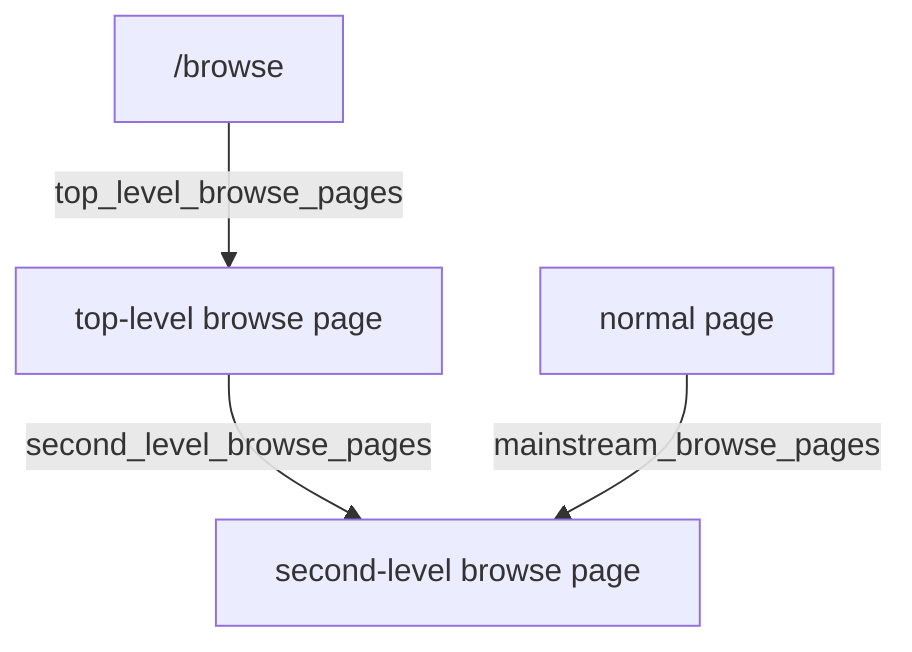
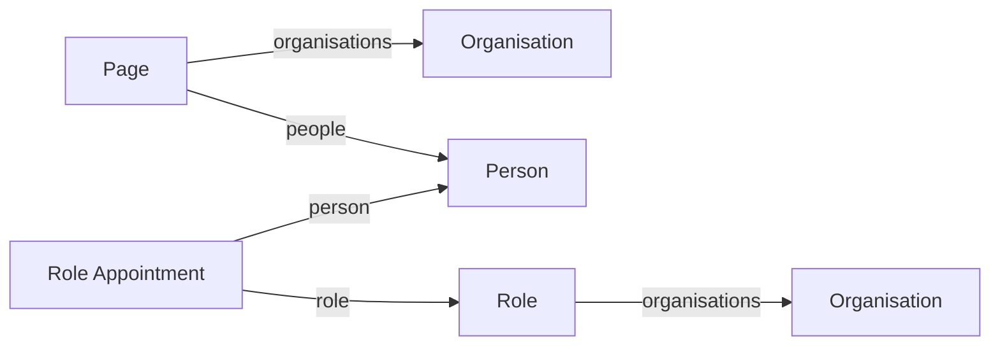
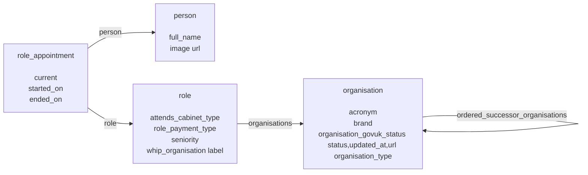

# How to query the Knowledge Graph

Read this guide if [GovSearch](https://gov-search.service.gov.uk) app and its corresponding BigQuery table `govuk_knowledge_graph.search.page` don't meet your needs.

If you already know which tables you might need, read on, but also read the documentation of the queries that create those tables.

* [`govuk-knowledge-graph.public.publishing_api_editions_current`](https://github.com/alphagov/govuk-knowledge-graph-gcp/blob/main/terraform/bigquery/README-publishing-api-links-current.md).
* [`govuk-knowledge-graph.public.publishing_api_links_current`](https://github.com/alphagov/govuk-knowledge-graph-gcp/blob/main/terraform/bigquery/README-publishing-api-links-current.md).
* [`govuk-knowledge-graph.public.publishing_api_unpublishings_current`](https://github.com/alphagov/govuk-knowledge-graph-gcp/blob/main/terraform/bigquery/README-publishing-api-unpublishings-current.md).
* [`govuk-knowledge-graph.public.taxonomy`](https://github.com/alphagov/govuk-knowledge-graph-gcp/blob/main/terraform/bigquery/README-taxonomy.md).

If you haven't used the data before, it might be worth reading through the section [Useful context to know](#useful-context-to-know).

For worked examples, read the section [Worked examples](#worked-examples).

If you need data about how GOV.UK content has changed over time, or a snapshot of GOV.UK content as it was at a moment in the past, then read about [the Publishing API Data Model](#the-publishing-api-data-model) and use the tables in the dataset `govuk-knowledge-graph.publishing_api`.

## Useful context to know

### What a 'page' is

There is no agreed definition of what a 'page' is.  A hand-wavey definition might be "What a browser displays at a given URL."  The [GovSearch](https://gov-search.service.gov.uk) app refines this definition as follows (see also the [query](https://github.com/alphagov/govuk-knowledge-graph-gcp/blob/main/terraform/bigquery/search-page.sql), which creates the BigQuery table `govuk-knowledge-graph.search.page`).

* Chapters of multi-part documents (ones whose `document_type` is `guide` or `travel_advice`) are each a page in their own right.
* Pages in a locale other than `en` are each a page in their own right, even if there exists a corresponding page in the `en` locale that contains the same content in the English language.
* Documents that don't have a URL of their own (such as certain role appointments) are included anyway, because they are sometimes rendered as part of another page.
* Redirected pages are excluded.
* Pages that display a "Withdrawn" banner are included.
* [Gone](https://docs.publishing.service.gov.uk/repos/content-store/gone_item.html) documents (ones where the browser responds with a 410 'gone' HTTP status, rather than a 404 'not found') are excluded.
* URLs recorded in Google Analytics (also known as GA4) that don't exist in GOV.UK (such as when a user puts a typo into the search bar) are excluded.

If that definition doesn't suit you, then you probably need to use the `govuk-knowledge-graph.public.publishing_api_editions_current` table.  Begin by reading the following section on [The Publishing API Data Model](#the-publishing-api-data-model).

### The Publishing API Data Model

The data in the Knowledge Graph is mostly from the GOV.UK Publishing API, which doesn't have a concept of a page, rather it has concepts of [content items, documents and editions](#content-items-documents-and-editions).  See the [GOV.UK Publishing API documentation](https://docs.publishing.service.gov.uk/repos/publishing-api/model.html), and the [documentation of the `publishing_api_editions_current` table](https://github.com/alphagov/govuk-knowledge-graph-gcp/blob/main/terraform/bigquery/README-publishing-api-editions-current.md).

The different ways that content is removed from the website are described by the concept of [unpublishings](#unpublishings).

The ways that content items are associated with one another (for example, a page is published by an organisation, a person is appointed to a role) are described by the concept of [links](#links).

#### Content items, documents and editions

The top-level object is the "content item", which has a unique `content_id`, and no other metadata.  There is no table of content items, because its only column would be `content_id`.

Each content item has at least one "document". Each document of a content item is in a different locale.  This is one way that translations are implemented, by creating each translation as a document of the same content item.  Unfortunately, some translations are implemented by creating each translation as a document of a different content item

Each document has at least one "edition", which describes the document. Only the most recent edition is valid. Previous editions record the previous state of that document.  The table `govuk-knowledge-graph.private.publishing_api_editions_current` contains only the most-recent edition of each document, and the table `govuk-knowledge-graph.private.publishing_api_editions_current` (`public` rather than `private`) contains only those editions that are also publicly available via the website and the GOV.UK Content API.

Not every edition has a URL (recorded in the data as a `base_path`, which omits the `https://www.gov.uk` part of each URL).  Editions that lack a URL are usually editions of a content item that represents something like a role appointment, which doesn't have its own page on the web, but is sometimes rendered as part of another page.

Some editions are used to present content at more than one URL.  These are editions whose `document_type` is `guide` or `travel_advice`. For example, the edition whose `base_path` is `/machine-game-duty` will be used to present content at each of the following URLs.

- https://www.gov.uk/machine-game-duty
- https://www.gov.uk/machine-game-duty/overview
- https://www.gov.uk/machine-game-duty/register
- https://www.gov.uk/machine-game-duty/how-much-you-pay
- https://www.gov.uk/machine-game-duty/file-return
- https://www.gov.uk/machine-game-duty/changes

In fact, it will be used to present content at any URL that begins with https://www.gov.uk/machine-game-duty, because its "route" is defined as a "prefix" type in the [GOV.UK router](https://github.com/alphagov/router). https://www.gov.uk/machine-game-duty/for-example.

#### Unpublishings

See the [GOV.UK Publishing API documentation](https://docs.publishing.service.gov.uk/repos/publishing-api/model.html#unpublishing).

The table `govuk-knowledge-graph.public.publishing_api_unpublishings_current` records unpublishings of only those editions that still exist in some form on the website and the GOV.UK Content API.  Consequently, the only types of unpublishings that are in the table are `gone`, `redirect` and `withdrawal`.  The types `vanish` and `substitute` are not present, because they link to editions that aren't publicly available.  If you need those records, use the table `govuk-knowledge-graph.publishing_api.unpublishings`.

'History mode' content is implemented in a different way from unpublishings.  A content item is in history mode if it has been tagged as being 'political', and has a link of type `government` to previous government. See the related [GitHub issue](https://github.com/alphagov/govuk-knowledge-graph-gcp/issues/554) and the [worked example](#history-mode).

#### Links

The table `govuk-knowledge-graph.public.publishing_api_links_current` abstracts some of the complexity of the [GOV.UK Publishing API implementation of links](https://docs.publishing.service.gov.uk/repos/publishing-api/model.html#linking).

Links are made between two content items, or between one whole content item and one specific edition of a content item. The table `govuk-knowledge-graph.public.publishing_api_links_current` resolves every link to a specific edition, which simplifies table joins in SQL.

The only metadata about a link is its `type` and, optionally, its `position`.  The position is used to render certain links in a given order, such as a set of links in the sidebar to related pages.

A commonly-used type of link is `primary_publishing_organisation` and `organisations`, which records which organisations published a given page.

Unfortunately, many pages don't use the links table to record associations with other content, and instead use the `details` column of their edition, which is a large JSON object that has a different schema according to the edition's `schema_name`.  See the section [Edition details](#edition-details).

#### Edition details

Most of the information about a piece of content is in a large JSON object in the `details` column of the table `govuk-knowledge-graph.public.publishing_api-editions-current`.  The schema of that JSON object varies according to the `schema_name` of the editions.  The schemas are available in the [publishing-api repository](https://github.com/alphagov/publishing-api/tree/main/content_schemas/dist/formats) and its [documentation](https://docs.publishing.service.gov.uk/content-schemas.html), and the relevant variant of each schema is the one called `publisher_v2`.  This sometimes differs slightly from what is used by the GOV.UK Content API, but usually it is easier to view the details of a particular page in the GOV.UK Content API than in BigQuery.  To view a page in the GOV.UK Content API, insert `/api/content` after `https://www.gov.uk` in the URL of the page.  For example, the page https://www.gov.uk/machine-game-duty becomes https://www.gov.uk/api/content/machine-game-duty.

See the BigQuery documentation of its [JSON functions](https://cloud.google.com/bigquery/docs/reference/standard-sql/json_functions) to extract information from the `details` column.

## Worked examples

### Pages with no description
> To improve site search results, I wanted to find any content items that did not have a description, so I could raise them with the publishers responsible for them.
>
> I only wanted pages that are currently live, and not withdrawn. (I also found that I had to exclude some document types that never have a description.)
>
> I wanted the base path, document type, title, description (to show that it’s empty), primary organisation, all organisations, and page views (to help prioritise more popular content).

To find out which schemas do not require a `description`, see the [publishing-api repository](https://github.com/alphagov/publishing-api/tree/main/content_schemas/dist/formats) or its [documentation](https://docs.publishing.service.gov.uk/content-schemas.html), such as the [contact](https://github.com/alphagov/govuk-content-schemas/blob/main/dist/formats/contact/publisher_v2/schema.json) ([documentation](https://docs.publishing.service.gov.uk/content-schemas/contact.html)) schema.

The best dataset to query would be the site search dataset itself.  It isn't among the GovGraph tables, though, so here are some alternatives.

#### The GovSearch table

The table `govuk-knowledge-graph.search.page` includes everything that is in GovSearch, and all the columns required for this query.  See the section [What a 'page' is](#what-a-page-is) for details.  A disadvantage is that it currently isn't possible to omit rows that represent sections of multi-part pages, such as `guide` and `travel_advice`.

```sql
SELECT
  url, -- base path with https://www.gov.uk prepended
  documentType,
  title,
  description,
  primary_organisation,
  organisations,
  page_views
FROM
  `govuk-knowledge-graph.search.page`
WHERE
  (description IS NULL
    OR description = '')
  AND url IS NOT NULL
  AND withdrawn_at IS NULL
  AND documentType NOT IN ('contact') -- for example
```

#### Not the GovSearch table

The advantage of using the tables that the GovSearch table `govuk-knowledge-graph.search.page` is derived from, rather than the GovSearch table itself, is that it becomes possible to omit rows that represent sections of multi-part pages, such as `guide` and `travel_advice`. The following query is based on [search-page.sql](../terraform/bigquery/search-page.sql), which is the query that creates the GovSearch table.

```sql
WITH
  editions AS (
  SELECT
    editions.*
  FROM
    `govuk-knowledge-graph.public.publishing_api_editions_current` AS editions
  LEFT JOIN
    `govuk-knowledge-graph.public.publishing_api_unpublishings_current` AS unpublishings
  ON
    (unpublishings.edition_id = editions.id)
  WHERE
    editions.description IS NULL
    AND editions.base_path IS NOT NULL
    AND (unpublishings.edition_id IS NULL)
    AND editions.schema_name NOT IN ( 'gone',
      'redirect',
      'contact' ) -- for example
    ),
  primary_publishing_organisation AS (
  SELECT
    links.source_edition_id AS edition_id,
    editions.title AS title
  FROM
    `govuk-knowledge-graph.public.publishing_api_links_current` AS links
  INNER JOIN
    editions
  ON
    editions.id = links.target_edition_id
  WHERE
    links.type = 'primary_publishing_organisation'
    -- Assume that the organisation has a document in the 'en' locale.
    -- If we allow every locale, then we will duplicate pages whose
    -- primary_publishing_organisation has documents in multiple locales.
    AND editions.locale = 'en' ),
  organisations AS (
  SELECT
    links.source_edition_id AS edition_id,
    ARRAY_AGG(DISTINCT editions.title) AS titles
  FROM
    `govuk-knowledge-graph.public.publishing_api_links_current` AS links
  INNER JOIN
    editions
  ON
    editions.id = links.target_edition_id
  WHERE
    links.type = 'organisations'
  GROUP BY
    links.source_edition_id ),
  pages AS (
  SELECT
    editions.id AS edition_id,
    COALESCE(content.base_path, editions.base_path) AS base_path,
    "https://www.gov.uk" || COALESCE(content.base_path, editions.base_path) AS url
  FROM
    editions
  LEFT JOIN
    `govuk-knowledge-graph.public.content`
  ON
    content.edition_id = editions.id
  WHERE
    TRUE
    AND editions.base_path IS NOT NULL
    -- Exclude pages that duplicate the first part of a multipart document.
    -- Equivalent statements are:
    -- `content.part_index IS NULL OR content.part_index > 1`
    -- `(NOT content.is_part) OR content.part_index > 1`
    AND content.is_part
    OR (content.part_index IS NULL) )
SELECT
  pages.url,
  editions.document_type AS documentType,
  editions.title,
  editions.description,
  primary_publishing_organisation.title AS primary_organisation,
  COALESCE(organisations.titles, []) AS organisations,
  page_views.number_of_views AS page_views,
  -- content.title is "title: part title" if it is a part of a document, but it
  -- doesn't include every schema_name, so fall back to editions.title.
FROM
  pages
INNER JOIN
  editions
ON
  editions.id = pages.edition_id -- one row per document
LEFT JOIN
  primary_publishing_organisation
ON
  primary_publishing_organisation.edition_id = pages.edition_id
LEFT JOIN
  organisations
ON
  organisations.edition_id = pages.edition_id
LEFT JOIN
  `govuk-knowledge-graph.private.page_views`
ON
  page_views.url = pages.url -- includes the slug of parts
  ;
```

### Start buttons

> To help developers improve analytics tracking on start buttons, I wanted to find all pages with a start button across GOV.UK, so that I could tell the developers all the pages that the new tracking needed to be published on.
>
> I wanted the URL or page path of all pages with a start button.

Start buttons are links, like any other hyperlink in a page. They are available in the table `govuk-knowledge-graph.public.start_button_links`, which is created by a [query](https://github.com/alphagov/govuk-knowledge-graph-gcp/blob/main/terraform/bigquery/start-button-links.sql). If you can't use that table, then you can find the same data in the table `public.publishing_api_editions_current`, in the `details` column, in the fields `transaction_start_link` and `start_button_text`, in editions with `schema_name = "transaction"`.

To get the URL of the page that has a given start button, join onto the `public.publishing_api_editions_current` table using the ID of the edition, as follows.

```sql
SELECT
  editions.base_path
FROM
  `govuk-knowledge-graph.public.start_button_links` AS start_buttons
INNER JOIN
  `govuk-knowledge-graph.public.publishing_api_editions_current` AS editions
ON
  editions.id = start_buttons.edition_id
```

### Finders metadata

> For all the items with `document_type = ‘finder’`, I wanted to get several fields, including:
>
> * `base_path`
> * `details.default_order`
> * `details.filter` (or `details.filter.format`, `details.filter.content_purpose_supergroup`, etc.)
> * `details.sort.name`
> * `links.email_alert_signup.base_path`

Use [BigQuery's JSON functions](https://cloud.google.com/bigquery/docs/reference/standard-sql/json_functions) to extract these fields from the `details` column of the table `govuk-knowledge-graph.public.publishing_api_editions_current`.

The `links.email_alert_signup.base_path` field isn't in the `details` column, it is in the `public.publishing_api_links_current` table, with `type - 'email_alert_signup'`.

To save on query costs while developing a query like this one (potentially running it several times), first create a table from a subset of the table `govuk-knowledge-graph.public.publishing_api_editions_current`.  This is only worthwhile when using the `details` column, which is by far the costliest.

```sql
-- Run this first query once
CREATE TABLE
  test.finder AS -- replace 'test' with a dataset of your choosing
SELECT
  *
FROM
  `govuk-knowledge-graph.public.publishing_api_editions_current`
WHERE
  schema_name = "finder";

-- This is the main query
WITH
  email_alert_signup AS (
  SELECT
    source_edition_id,
    target_base_path
  FROM
    `govuk-knowledge-graph.public.publishing_api_links_current`
  WHERE
    type = 'email_alert_signup' )
SELECT
  id,
  base_path,
  JSON_VALUE(details, "$.default_order") AS default_order,
  JSON_VALUE(details, "$.default_order") AS FILTER,
  JSON_VALUE(details, "$.default_order") AS sort_name,
  email_alert_signup.target_base_path AS email_alert_signup_base_path
FROM
  test.finder AS editions
LEFT JOIN
  email_alert_signup
ON
  email_alert_signup.source_edition_id = editions.id
WHERE
  schema_name = 'finder' -- or document_type, but schema_name governs what is in the details column
```

### Organisation analytics identifiers

> I would like to understand how we can reproduce the output from this API call to the GOV.UK Search API
>
> `=ImportJSON("https://www.gov.uk/api/search.json?aggregate_organisations=1400&count=0", "/aggregates/organisations/options/value/title,/aggregates/organisations/options/value/organisation_state,/aggregates/organisations/options/value/slug,/aggregates/organisations/options/value/analytics_identifier,/aggregates/organisations/options/value/acronym,/aggregates/organisations/options/value/organisation_type", "noTruncate,noInherit")`
>
> Results are in this sheet
> https://docs.google.com/spreadsheets/d/1m3U3bR4mOREFYK1xDWk4MYRsFz6weBeqtJr2CztRzMI/edit#gid=575619104

An example result of that query is

| Organisation Type | Organisation State | Acronym | Title                         | Analytics Identifier | Slug                            |
|-------------------|--------------------|---------|-------------------------------|----------------------|---------------------------------|
| executive_agency  | live               | HMCTS   | HM Courts & Tribunals Service | EA73                 | hm-courts-and-tribunals-service |

You can see how the data of an organisation is structured by finding its web page, and then altering the URL to inspect it in the GOV.UK Content API.  The example above is at https://www.gov.uk/api/content/government/organisations/hm-courts-and-tribunals-service.

From that example, we can see that the `schema_name` is `organisation`, so we will filter for editions of that schema.  Because the fields `title` and `analytics_identifier` are at the top level of that JSON structure, we expect to find them as columns of the table `public.publishing_api_editions_current`.  The `details` field contains `organisation_type` and `acronym`, so we would expect to find those in the `details` column.  The `details` field also contains `organisation_govuk_status`, which itself contains `status: "live"`, which corresponds with the "Organisation State".  The slug will have to be derived from the `base_path`.

To save on query costs while developing a query like this one (potentially running it several times), first create a table from a subset of the table `govuk-knowledge-graph.public.publishing_api_editions_current`.  This is only worthwhile when using the `details` column, which is by far the costliest.

```sql
-- Run this first query once
CREATE TABLE
  test.organisation AS -- replace 'test' with a dataset of your choosing
SELECT
  *
FROM
  `govuk-knowledge-graph.public.publishing_api_editions_current`
WHERE
  schema_name = "organisation";

-- This is the main query
SELECT
  JSON_VALUE(details, "$.organisation_type") AS organisation_type,
  JSON_VALUE(details, "$.organisation_govuk_status.status") AS organisation_state,
  JSON_VALUE(details, "$.acronym") AS organisation_type,
  title,
  analytics_identifier,
  REGEXP_EXTRACT(base_path, "[^/]+$") AS slug
FROM
  test.organisation
```

Results typically differ from the Search API because the Search API excludes rather a lot of documents, and presents some of the data differently.  In this case, the Search API seems to derive the fields `organisation_state` and `organisation_closed_state` from the Publishing API's `organisation_govuk_status.status` field.

### Mainstream browse

The "mainstream browse taxonomy" (not to be confused with the "taxonomy") is a tree structure for navigating GOV.UK content.  The root of the tree the page /browse. Below /browse are "top-level browse pages", and below those are "second-level browse pages".  The leaves of the tree are normal pages, linked to second-level browse pages.  Each page can have more than one parent.  For example, https://www.gov.uk/vat-charities is a child of both https://www.gov.uk/browse/tax/vat and https://www.gov.uk/browse/citizenship/charities-honours. Only one parent is chosen to be displayed in the breadcrumb links at the top of the page.

#### Use the table `public.mainstream_browse`

The table `public.mainstream_browse` can be used to find

* the immediate parent of a page (it might have more than one immediate parent)
* pages that are descendants of a given browse page
* where a page appears in the list of links given by its parent, and under which heading

```sql
-- The immediate parents of pages that have more than one parent
SELECT
  base_path,
  COUNT(*) AS n_parents,
  ARRAY_AGG(parent_base_path)
FROM
  public.mainstream_browse
GROUP BY
  edition_id,
  base_path
HAVING
  n_parents > 1
```

```sql
-- Every descendant of the browse page /browse/tax, which has
-- another level of browse pages below it in the hierarchy.
SELECT
  mainstream_browse.base_path,
  mainstream_browse.ancestors
FROM
  public.mainstream_browse
CROSS JOIN
  UNNEST(ancestors) AS ancestor
WHERE
  ancestor.base_path = '/browse/tax'
```

```sql
-- Every descendant of the browse page /browse/tax. This is more
-- pages than are linked to from the /browse/tax page itself, because
-- there is -- another level of browse pages below it in the hierarchy.
SELECT
  mainstream_browse.base_path,
  mainstream_browse.ancestors
FROM
  public.mainstream_browse
CROSS JOIN
  UNNEST(ancestors) AS ancestor
WHERE
  ancestor.base_path = '/browse/tax'
```

#### Derive the mainstream browse hierarchy yourself

The hierarchy (ignoring groups) can be derived as follows.
* /browse is the root, emit a path: /browse, set `level=1`.
* From /browse, for each one of `top_level_browse_pages`, emit a path: /browse and the page itself, set `level = 2`.
* From each top-level browse page, for each one of `second_level_browse_pages`, emit a path: /browse, the page itself, and the second-level browse page, set level `level=3`.
* For each second-level page, emit a path: /browse, `active_top_level_browse_page`, itself, each of `children`, set `level=4`.



The following query returns one row per page, per parent.  If a page has more than one parent, then it has a row for each parent.  Each row includes the full ancestory of the page, all the way up to /browse, via the given parent.  Uness the page is a leaf (not a mainstream browse page in its own right), it includes itself among its ancestors.  If the page belongs to a named group of its parent, then the name of the group, the index of the group (zero-based), and the index of the page within the group (zero-based) are given.  If a browse topic includes links to a redirected page, the link is omitted, because the website omits such links too.

```sql
WITH
browse_pages AS (
  SELECT *
  FROM `public.publishing_api_editions_current`
  WHERE schema_name = 'mainstream_browse_page'
),
links AS (
  SELECT *
  FROM `public.publishing_api_links_current`
  WHERE type IN ('top_level_browse_pages', 'second_level_browse_pages', 'mainstream_browse_pages')
),
editions AS (
  SELECT
    id,
    content_id
  FROM public.publishing_api_editions_current
  WHERE schema_name NOT IN ('gone', 'redirect')
),
root AS (
  SELECT
    id AS edition_id,
    '/browse' AS base_path,
    id AS parent_edition_id,
    '/browse' AS parent_base_path,
    1 AS level,
    [STRUCT(id AS edition_id, '/browse' AS base_path, 1 AS level)] AS ancestors
  FROM browse_pages
  WHERE base_path = '/browse'
),
top_level_browse_pages AS (
  SELECT
    links.target_edition_id AS edition_id,
    links.target_base_path AS base_path,
    root.edition_id AS parent_edition_id,
    root.base_path AS parent_base_path,
    2 AS level,
    ARRAY_CONCAT(
      root.ancestors,
      [STRUCT(
        links.target_edition_id AS edition_id,
        links.target_base_path AS target_base_path,
        2 AS level
      )]
    ) AS ancestors
  FROM links
  INNER JOIN root ON root.edition_id = links.source_edition_id
  INNER JOIN editions ON editions.id = links.target_edition_id
  WHERE links.type = 'top_level_browse_pages'
),
second_level_browse_pages AS (
  SELECT
    links.target_edition_id AS edition_id,
    links.target_base_path AS base_path,
    top_level_browse_pages.edition_id AS parent_edition_id,
    top_level_browse_pages.base_path AS parent_base_path,
    3 AS level,
    ARRAY_CONCAT(
      top_level_browse_pages.ancestors,
      [STRUCT(
        links.target_edition_id AS edition_id,
        links.target_base_path AS target_base_path,
        3 AS level
      )]
    ) AS ancestors
  FROM links
  INNER JOIN top_level_browse_pages ON top_level_browse_pages.edition_id = links.source_edition_id
  INNER JOIN editions ON editions.id = links.target_edition_id
  WHERE links.type = 'second_level_browse_pages'
),
leaves AS (
  SELECT
    links.source_edition_id AS edition_id,
    links.source_base_path AS base_path,
    second_level_browse_pages.edition_id AS parent_edition_id,
    second_level_browse_pages.base_path AS parent_base_path,
    4 AS level,
    second_level_browse_pages.ancestors
  FROM links
  INNER JOIN editions ON editions.id = links.source_edition_id
  INNER JOIN second_level_browse_pages ON second_level_browse_pages.edition_id = links.target_edition_id
  WHERE links.type = 'mainstream_browse_pages'
),
group_links AS (
  SELECT
    browse_pages.id AS source_edition_id,
    editions.id AS target_edition_id,
    group_index,
    JSON_VALUE(link_groups, "$.name") AS group_name,
    page_index
  FROM browse_pages
  INNER JOIN second_level_browse_pages ON second_level_browse_pages.edition_id = browse_pages.id
  CROSS JOIN UNNEST(JSON_QUERY_ARRAY(details, "$.groups")) AS link_groups WITH OFFSET AS group_index
  CROSS JOIN UNNEST(JSON_VALUE_ARRAY(link_groups, "$.content_ids")) AS group_content_ids WITH OFFSET AS page_index
  LEFT JOIN editions ON editions.content_id = group_content_ids
),
all_pages AS (
  SELECT * FROM root
  UNION ALL SELECT * FROM top_level_browse_pages
  UNION ALL SELECT * FROM second_level_browse_pages
  UNION ALL SELECT * FROM leaves
)
SELECT
  all_pages.*,
  group_links.group_index,
  group_links.group_name,
  group_links.page_index
FROM all_pages
LEFT JOIN group_links ON group_links.source_edition_id = all_pages.parent_edition_id AND group_links.target_edition_id = all_pages.edition_id
```

### Pages tagged to ministers

> A department approached us to get a list of their content which had been tagged to a Minister. This is in the context of a general election and the need to have a better knowledge of what announcements each Minister had been associated with. These were to be confined to current ministers.

The tables `public.publishing_api_editions_current` and `public.publishing_api_links_current` must each be queried several times, in alternating fashion, to obtain the linkages in the diagram below.



The organisations can each be constrained to be the Department for Education, the roles can be constrained to be ministerial, and the role appointments can be constrained to be current.

```sql
-- Every document ever published by the Department for Education
-- and by someone who is a currently minister in the Department for Education.
-- They didn't necessarily hold the role when the document was published.

-- 'organisations' is "All organisations linked to this content item. This should include lead organisations."
-- 'ordered_parent_organisations' is "Organisations that own this role."
-- Documentation: https://docs.publishing.service.gov.uk/content-schemas/role.html
-- But: https://www.gov.uk/api/content/government/ministers/minister-of-state-minister-for-skills-apprenticeships-and-higher-education only has ordered_parent_organisations

SELECT
  edition.id AS edition_id,
  edition.base_path AS edition_base_path,
  edition.first_published_at,
  role.title AS role_title,
  role.document_type = 'ministerial_role' AS is_ministerial,
  JSON_VALUE(role.details, "$.attends_cabinet_type") AS attends_cabinet_type,
  JSON_VALUE(role.details, "$.role_payment_type") AS role_payment_type,
  JSON_VALUE(role.details, "$.seniority") AS seniority,
  JSON_VALUE(role.details, "$.whip_organisation") AS whip_organisation,
  JSON_VALUE(role_appointment.details, "$.started_on") AS appointment_started,
  JSON_VALUE(role_appointment.details, "$.ended_on") AS appointment_ended,
  person.id AS person_edition_id,
  person.title AS person_title
FROM public.publishing_api_editions_current as edition
inner join public.publishing_api_links_current as link_edition_to_person on link_edition_to_person.source_edition_id = edition.id
inner join public.publishing_api_editions_current as person on person.id = link_edition_to_person.target_edition_id
inner join public.publishing_api_links_current as link_role_appointment_to_person on link_role_appointment_to_person.target_edition_id = person.id
inner join public.publishing_api_editions_current as role_appointment on role_appointment.id = link_role_appointment_to_person.source_edition_id
inner join public.publishing_api_links_current as link_role_appointment_to_role on link_role_appointment_to_role.source_edition_id = role_appointment.id
inner join public.publishing_api_editions_current as role on role.id = link_role_appointment_to_role.target_edition_id
inner join public.publishing_api_links_current as link_role_to_organisation on link_role_to_organisation.source_edition_id = role.id
inner join public.publishing_api_editions_current as role_organisation on role_organisation.id = link_role_to_organisation.target_edition_id
inner join public.publishing_api_links_current as link_edition_to_organisation on link_edition_to_organisation.source_edition_id = edition.id
inner join public.publishing_api_editions_current as edition_organisation on edition_organisation.id = link_edition_to_organisation.target_edition_id
WHERE TRUE
AND link_edition_to_person.type = "people"
AND link_role_appointment_to_person.type = "person"
AND link_role_appointment_to_role.type = "role"
AND link_role_to_organisation.type IN ('organisations', 'ordered_parent_organisations')
AND link_edition_to_organisation.type = 'organisations'
AND edition.locale = 'en'
AND role_appointment.locale = 'en'
AND role.locale = 'en'
AND role_organisation.locale = 'en'
AND person.locale = 'en'
AND edition_organisation.base_path = '/government/organisations/department-for-education'
AND role_organisation.base_path = '/government/organisations/department-for-education'
AND role.document_type = "ministerial_role"
AND JSON_VALUE(role_appointment.details, "$.current") = "true"
ORDER BY edition.first_published_at DESC
```

### History mode

Content is displayed on the website in "history mode" when both the following are true.

* It is "political" (recorded in the `details` column as `political: "true"`)
* It was published during a previous government (recorded as a link to a previous government)

The following query retrieves all political content, and the name and dates of the government that it is linked to. Not every election results in a change of government, so the publication date of the content is included.

```sql
SELECT
  editions.id AS edition_id,
  editions.base_path,
  editions.first_published_at,
  editions.schema_name,
  government.title AS government,
  JSON_VALUE(government.details, "$.current") = 'true' AS government_is_current,
  JSON_VALUE(government.details, "$.started_on") AS government_started_on,
  JSON_VALUE(government.details, "$.ended_on") AS government_ended_on
FROM
  public.publishing_api_editions_current AS editions
INNER JOIN
  `govuk-knowledge-graph.public.publishing_api_links_current` AS links
ON
  links.source_edition_id = editions.id
INNER JOIN
  public.publishing_api_editions_current AS government
ON
  government.id = links.target_edition_id
WHERE
  links.type = 'government'
  AND JSON_VALUE(editions.details, "$.political") = 'true'
```

### Omit redirected, withdrawn and 'gone' pages

### Taxonomy

### Content published by a given organisation

### Content associated with a given person

### Content associated with someone in a given role

### Related links (also known as recommended links, rendered in the sidebar)

### Structure of government organisations, roles and people

See the following diagram.



The data could be explored in Neo4j, which is a graph database that has browser-based user interface to display the results of database query as circles (nodes) and lines (edges).

#### 1. Export data from BigQuery

The results of the following query can be exported from BigQuery as a 6MB uncompressed CSV file.

```sql
-- One row per node and per relationship, for import into Neo4j
CREATE OR REPLACE TABLE test.org_graph AS
-- One row per node and per relationship, for import into Neo4j
WITH
editions AS (
  SELECT *
  FROM `govuk-knowledge-graph.public.publishing_api_editions_current`
  WHERE locale = 'en'
),
links AS (
  SELECT *
  FROM `govuk-knowledge-graph.public.publishing_api_links_current`
),
organisations AS (
  SELECT
    "node" AS type,
    id,
    [schema_name] AS labels,
    JSON_OBJECT(
        "title", title,
        "acronym", JSON_VALUE(details, "$.acronym"),
        "brand", JSON_VALUE(details, "$.brand"),
        "status", JSON_VALUE(details, "$.organisation_govuk_status.status"),
        "updated_at", JSON_VALUE(details, "$.organisation_govuk_status.updated_at"),
        "url", JSON_VALUE(details, "$.organisation_govuk_status.url"),
        "type", JSON_VALUE(details, "$.organisation_type")
    ) AS properties
  FROM editions
  WHERE schema_name = "organisation"
),
ordered_child_organisations AS (
  SELECT
    "relationship" AS type,
    0 AS id,
    links.type AS label,
    JSON_OBJECT("id", source_edition_id) AS `start`,
    JSON_OBJECT("id", target_edition_id) AS `end`
  FROM links
  INNER JOIN organisations AS sources ON sources.id = links.source_edition_id
  INNER JOIN organisations AS targets ON targets.id = links.target_edition_id
  WHERE links.type = 'ordered_child_organisations'
),
ordered_parent_organisations AS (
  SELECT
    "relationship" AS type,
    0 AS id,
    links.type AS label,
    JSON_OBJECT("id", source_edition_id) AS `start`,
    JSON_OBJECT("id", target_edition_id) AS `end`
  FROM links
  INNER JOIN organisations AS sources ON sources.id = links.source_edition_id
  INNER JOIN organisations AS targets ON targets.id = links.target_edition_id
  WHERE links.type = 'ordered_parent_organisations'
),
ordered_successor_organisations AS (
  SELECT
    "relationship" AS type,
    0 AS id,
    links.type AS label,
    JSON_OBJECT("id", source_edition_id) AS `start`,
    JSON_OBJECT("id", target_edition_id) AS `end`
  FROM links
  INNER JOIN organisations AS sources ON sources.id = links.source_edition_id
  INNER JOIN organisations AS targets ON targets.id = links.target_edition_id
  WHERE links.type = 'ordered_successor_organisations'
),
roles AS (
  SELECT
    "node" AS type,
    id,
    [schema_name] AS labels,
    JSON_OBJECT(
        "title", title,
        "attends_cabinet_type", JSON_VALUE(details, "$.attends_cabinet_type"),
        "payment_type", JSON_VALUE(details, "$.role_payment_type"),
        "seniority", JSON_VALUE(details, "$.seniority"),
        "whip_organisation", JSON_VALUE(details, "$.whip_organisation.label")
    ) AS properties
  FROM editions
  WHERE schema_name = "role"
),
role_appointments AS (
  SELECT
    "node" AS type,
    id,
    [schema_name] AS labels,
    JSON_OBJECT(
        "current", JSON_VALUE(details, "$.current") = 'true',
        "started_on", JSON_VALUE(details, "$.started_on"),
        "ended_on", JSON_VALUE(details, "$.ended_on")
    ) AS properties
  FROM editions
  WHERE schema_name = "role_appointment"
),
persons AS (
  SELECT
    "node" AS type,
    id,
    [schema_name] AS labels,
    JSON_OBJECT(
        "title", title,
        "full_name", JSON_VALUE(details, "$.full_name"),
        "image_url", JSON_VALUE(details, "$.image.url")
    ) AS properties
  FROM editions
  WHERE schema_name = "person"
),
person AS (
  SELECT
    "relationship" AS type,
    0 AS id,
    links.type AS label,
    JSON_OBJECT("id", source_edition_id) AS `start`,
    JSON_OBJECT("id", target_edition_id) AS `end`
  FROM links
  INNER JOIN role_appointments AS sources ON sources.id = links.source_edition_id
  INNER JOIN persons AS targets ON targets.id = links.target_edition_id
  WHERE links.type = 'person'
),
role AS (
  SELECT
    "relationship" AS type,
    0 AS id,
    links.type AS label,
    JSON_OBJECT("id", source_edition_id) AS `start`,
    JSON_OBJECT("id", target_edition_id) AS `end`
  FROM links
  INNER JOIN role_appointments AS sources ON sources.id = links.source_edition_id
  INNER JOIN roles AS targets ON targets.id = links.target_edition_id
  WHERE links.type = 'role'
),
role_organisations AS (
  SELECT
    "relationship" AS type,
    0 AS id,
    links.type AS label,
    JSON_OBJECT("id", source_edition_id) AS `start`,
    JSON_OBJECT("id", target_edition_id) AS `end`
  FROM links
  INNER JOIN roles AS sources ON sources.id = links.source_edition_id
  INNER JOIN organisations AS targets ON targets.id = links.target_edition_id
  WHERE links.type = 'organisations'
),
relationships AS (
              SELECT * FROM ordered_child_organisations
    UNION ALL SELECT * FROM ordered_parent_organisations
    UNION ALL SELECT * FROM ordered_successor_organisations
    UNION ALL SELECT * FROM person
    UNION ALL SELECT * FROM role
    UNION ALL SELECT * FROM role_organisations
),
nodes AS (
              SELECT * FROM organisations
    UNION ALL SELECT * FROM roles
    UNION ALL SELECT * FROM role_appointments
    UNION ALL SELECT * FROM persons
)
          SELECT TO_JSON_STRING(t) AS `json` FROM relationships AS t
UNION ALL SELECT TO_JSON_STRING(t) AS `json` FROM nodes AS t
```

Convert the query results into something that can be imported into Neo4j by using the following Bash script, which assumes that the exported query results are in a file called `govuk.csv`, and which will create a new file called `govuk.json`.

```sh
#!/bin/bash

# 1. Remove the first line, which is a column header
# 2. Unescape double quotes
# 3. Remove leading and trailing double quotes
# 4. Sort nodes to the top of the file, otherwise relationships will fail
#    because the corresponding nodes won't exist yet.

tail -n +2 govuk.csv \
| sed --expression='s/\"\"/\"/g' \
| sed --expression='s/^\"//g' \
| sed --expression='s/\"$//g' \
| sort \
> govuk.json
```

#### 2. Start an instance of Neo4j in docker

Enable an APOC extension for importing JSON, and map some folders.

```sh
docker run \
    --restart always \
    --publish=7474:7474 --publish=7687:7687 \
    --env NEO4J_AUTH=none \
    --env NEO4J_apoc_export_file_enabled=true \
    --env NEO4J_apoc_import_file_enabled=true \
    --env NEO4J_apoc_import_file_use__neo4j__config=true \
    --env NEO4J_PLUGINS=\[\"apoc\"\] \
    --env NEO4J_dbms_security_procedures_unrestricted=apoc.\\\* \
    --volume=$PWD/data:/data \
    --volume=$PWD/plugins:/plugins \
    --volume=$PWD/import:/var/lib/neo4j/import \
    neo4j:latest
```

#### 3. Import the data into Neo4j

Copy `govuk.json` to the `import` folder, where Neo4j can access it.  You'll need `sudo` because docker controls the folder.

```sh
sudo cp govuk.json import
```

Open http://localhost:7474/browser/ in a browser, and log in (don't enter anything into the username or password fields).

Run the following Cypher query to import the data.  It will take several minutes.  It should be much quicker, but for some reason APOC requires the constraints to be created before the data is imported, which means the import takes forever because it has to update the indexes incrementally, instead of constructing them in one go at the end.

```cypher
// Import the GOV.UK data
CREATE CONSTRAINT FOR (n:person) REQUIRE n.neo4jImportId IS UNIQUE;
CREATE CONSTRAINT FOR (n:role_appointment) REQUIRE n.neo4jImportId IS UNIQUE;
CREATE CONSTRAINT FOR (n:role) REQUIRE n.neo4jImportId IS UNIQUE;
CREATE CONSTRAINT FOR (n:organisation) REQUIRE n.neo4jImportId IS UNIQUE;
CALL apoc.import.json("file:///govuk.json") // Takes a few minutes
```


[GovSearch]: https://gov-search.service.gov.uk
[bigquery-json]: https://cloud.google.com/bigquery/docs/reference/standard-sql/json_functions
[govuk-content-schemas]: https://github.com/alphagov/publishing-api/tree/main/content_schemas/dist/formats
[govuk-schema-docs]: https://docs.publishing.service.gov.uk/content-schemas.html
[govuk-publishing-api-model]: https://docs.publishing.service.gov.uk/repos/publishing-api/model.html
[govuk-router]: https://github.com/alphagov/router
[govuk-unpublishing]: https://docs.publishing.service.gov.uk/repos/publishing-api/model.html#unpublishing
[history-mode-issue]: https://github.com/alphagov/govuk-knowledge-graph-gcp/issues/554
[publishing-api-editions-query-docs]: https://github.com/alphagov/govuk-knowledge-graph-gcp/blob/main/terraform/bigquery/README-publishing-api-editions-current.md
[search-page-query]: https://github.com/alphagov/govuk-knowledge-graph-gcp/blob/main/terraform/bigquery/search-page.sql
[start-button-links-query]: https://github.com/alphagov/govuk-knowledge-graph-gcp/blob/main/terraform/bigquery/start-button-links.sql

[publishing-api-links-query-docs]: https://github.com/alphagov/govuk-knowledge-graph-gcp/blob/main/terraform/bigquery/README-publishing-api-links-current.md
[publishing-api-unpublishings-query-docs]: https://github.com/alphagov/govuk-knowledge-graph-gcp/blob/main/terraform/bigquery/README-publishing-api-unpublishings-current.md
[taxonomy-query-docs]: https://github.com/alphagov/govuk-knowledge-graph-gcp/blob/main/terraform/bigquery/README-taxonomy.md
