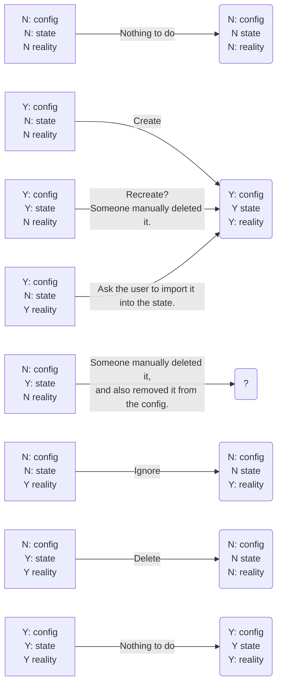

# Terraform state transitions

Terraform tries not to delete or overwrite something that it didn't create in
the first place.  It does this by storing the current 'state' of objects that it
did create.  When an object is later removed from the config, but is still in
the 'state', then Terraform will delete it.  But if an object exists in reality
and not in the 'state', then Terraform will leave it be.

